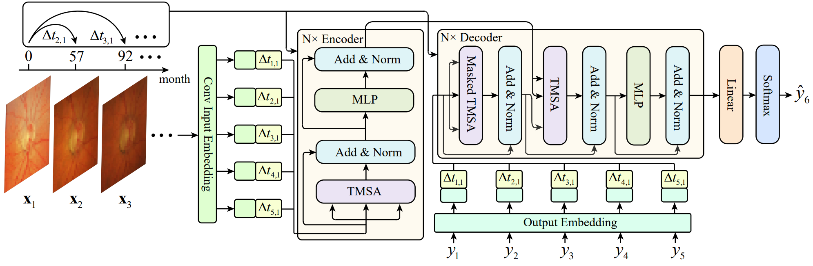

# GLIM-Net: Chronic Glaucoma Forecast Transformer for Irregularly Sampled Sequential Fundus Images



## Abstract
Chronic Glaucoma is an eye disease with progressive optic nerve damage. It is the second leading cause of blindness after cataract and the first leading cause of irreversible blindness. Glaucoma forecast can predict
future eye state of a patient by analyzing the historical fundus images, which is helpful for early detection and intervention of potential patients and avoiding the outcome of blindness. In this paper, we propose a GLaucoma forecast transformer based on Irregularly saMpled fundus images named GLIM-Net to predict the probability of developing glaucoma in the future. The main challenge is that the existing fundus images are often sampled at irregular times, making it difficult to accurately capture the subtle progression of glaucoma over time. We therefore introduce two novel modules, namely time positional encoding and time-sensitive MSA (multi-head self-attention) modules, to address this challenge. Unlike many existing works that focus on prediction for an unspecified future time, we also propose an extended model which is further capable of prediction conditioned on a specific future time. The
experimental results on the benchmark dataset SIGF show that the accuracy of our method outperforms the state-ofthe-art models. In addition, the ablation experiments also confirm the effectiveness of the two modules we propose, which can provide a good reference for the optimization of Transformer models.

## Environment

```
python 3.6
pip install -r requirement.txt
```

## Data

Please download dataset [SIGF](https://github.com/XiaofeiWang2018/DeepGF).

## Training

```
python train.py --name exp --strategy_list 680 172 172 88 80 48
```

## Acknowledgments

The structure of this code is based on [DeepGF](https://github.com/XiaofeiWang2018/DeepGF) and [transformer](https://www.github.com/kyubyong/transformer).

## Citation

If you find our work useful in your research, please consider citing:

```
@article{hu2023glim,
  title={GLIM-Net: chronic glaucoma forecast transformer for irregularly sampled sequential fundus images},
  author={Hu, Xiaoyan and Zhang, Ling-Xiao and Gao, Lin and Dai, Weiwei and Han, Xiaoguang and Lai, Yu-Kun and Chen, Yiqiang},
  journal={IEEE Transactions on Medical Imaging},
  year={2023},
  publisher={IEEE}
}
```
